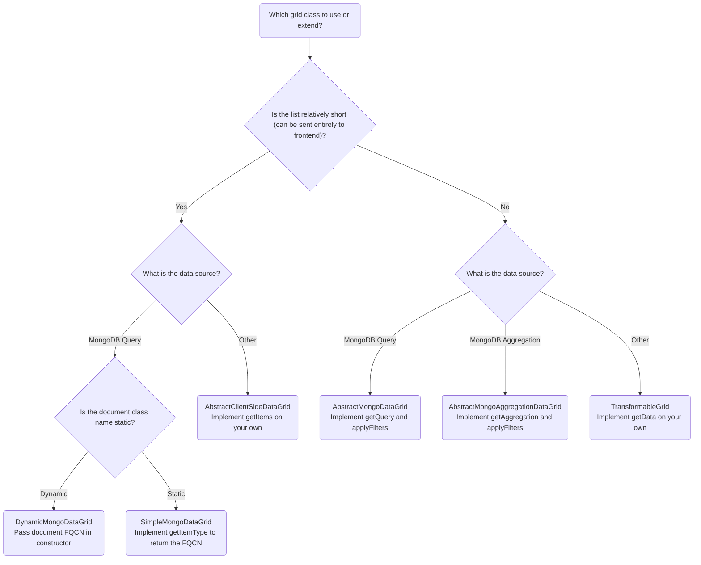
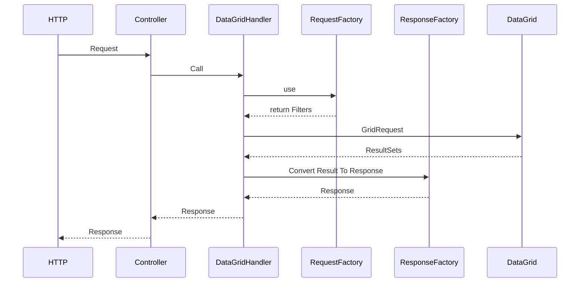

# Data Grids

Data source and frontend separation is achieved using custom DataGrid component.
Following article explains how to use this powerful tool.

## Background

Since this management application allows listing different documents and objects with unified user interface,
it was necessary to create a generic way to create lists from different data sources that match their look and feel.

## Features

- Isolated from HTTP layer (ie. easy to change request/response format without touching individual grids)
- Support both client-side and server-side filtering, pagination and sorting
- Can be used on any data source (even remote API)
- Offers several types of pagination (depending on source and performance optimizations)
- Contains helpful and generic base classes

## DataGrid components

Each DataGrid consists of following components:

- the grid (implementing `App\Application\DataGrid\DataGrid`) - where fetching the data occurs
- filters (implementing `App\Application\DataGrid\Filters\Filters`) - filter DTO
- frontend component (using `ServerTable.tsx`) - configures columns and behaviour

## Additional components

To abstract from HTTP layer, grids use `GridRequest` and `ResultSet` DTOs to communicate.
Those are handled by `RequestFactory` and `ResponseFactory` coordinated by `DataGridHandler` (see class documentations).

## Which base grid class to use?

Please refer to the Mermaid chart below or keep reading for more detailed description:

## Simple grids

### Dynamic grids

Most common scenario of creating the grid is listing a short list of Doctrine Documents.
In order to achieve that, a `DynamicMongoDataGrid` can be used. Passing `DocumentManager`, the document class
and optional callback for transforming the data is enough to start listing the documents.
In order to make it even simpler, `BaseController` contains a `handleGrid()` method.

Please note, that this grid fetches all documents into memory so it may only be used for relatively small collections.
Make sure the `ServerTable` is set to `serverSide: false` to make frontend take care of filtering, sorting and pagination.

The benefit of this approach is that it does not require to create any additional classes.

### Simple Mongo grids

If you wish to customize the query used to fetch the data, you might want to create your own datagrid class.
Extending `SimpleMongoDataGrid` makes it easy to create such grid.

## Advanced grids

If you wish to have more control over the data source or filters or just want to know how does it work under the hood,
you may want to implement your grids using following approaches.

### Client side grids

If you wish to use a different data source than a Doctrine Document or you want to list embedded objects,
`AbstractClientSideDataGrid` provides common logic to do so.

Simply implement `getItems()` method with any data source that provides all items at once.
Please note it should not handle any filters nor pagination as it will happen on frontend side.

### Server-side grids

If you are expecting more results and you wish to paginate and filter them on server side, you may want to extend:

- `AbstractMongoDataGrid` - Uses Doctrine Mongo Query builder as data source and contains filtering and sorting helpers
- `AbstractMongoAggregationDataGrid` - Uses Doctrine Mongo Aggregation builder as data source

In order to use them, you have to create a custom filter DTO.
This is because filtering happens on server side and it has to know what options are available.
Use `applyFilters()` to apply filtering to the query/aggregation.

To simplify sorting handling, in most cases it is enough to override `getSortMap()` method.
It basically translates frontend column names to database fields for security reasons.
If you wish to sort by a custom expression, you can add that logic in `applySorting()` and then call `parent::applySorting()` afterwards.

### Custom grids

If you wish to use a different data source (like external API), you will need to implement the `getData()` method on your own.
See `FederatedIdentityList` for reference.

## Types of pagination

Developers may choose one of following pagination types depending on the source of the data and the number of rows:

- `length_aware` - the most common pagination type - offset based, provides total number of results to determine the number of pages
- `simple` - offset based pagination which does not provide the total number of results for performance reasons -
existence of the next page can be determined by fetching one more item than requested and comparing the result set size
- `cursor` - when data source uses cursor-based pagination, ie. AWS Cognito -
number of pages is not determined but existence of the next page can be determined if `nextCursor` is not `null`

These rules do not apply to client-side pagination, where `length_aware` with `perPage: -1` will be used at all times.

See `\App\Application\DataGrid\Pagination\PaginationInfo` and derived classes.

## Request-Response flow

